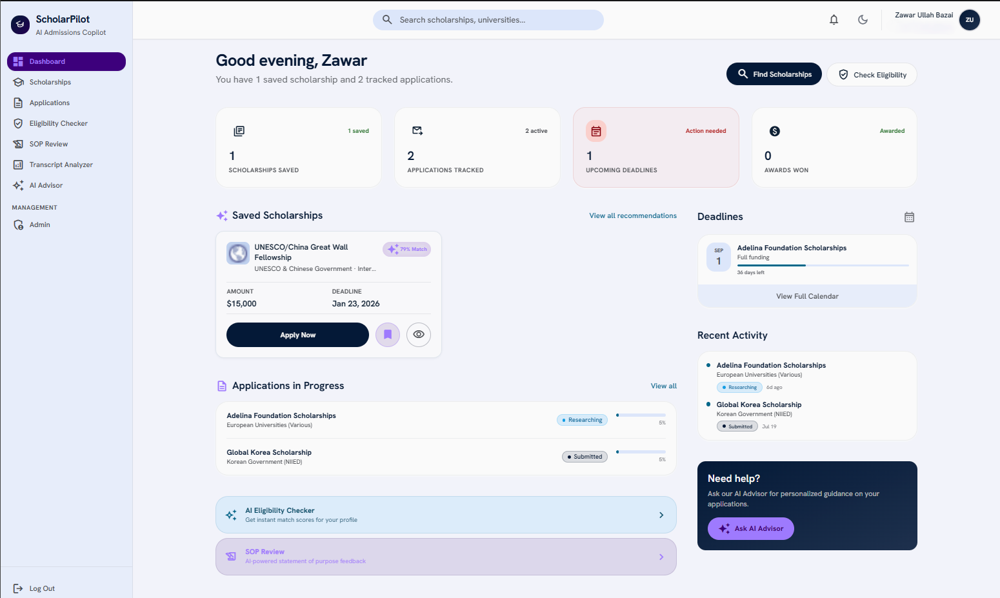
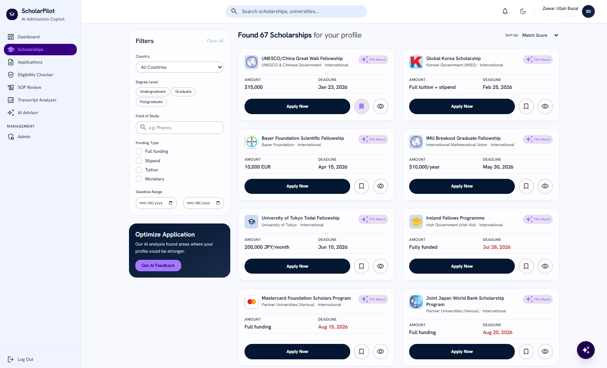
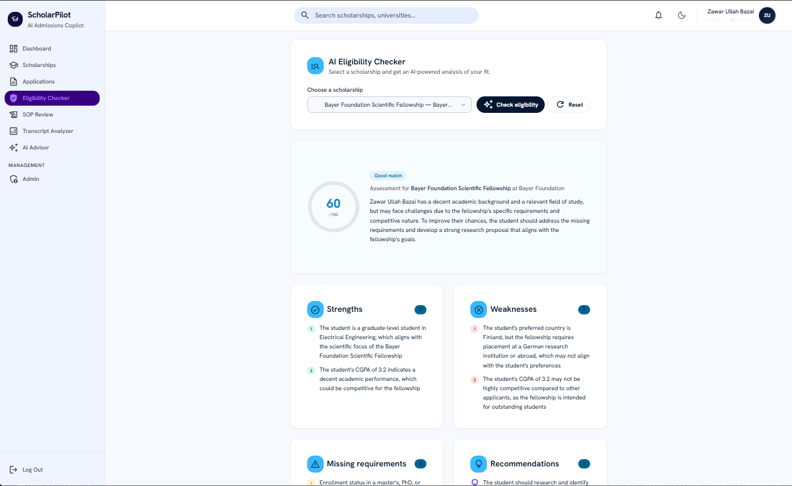
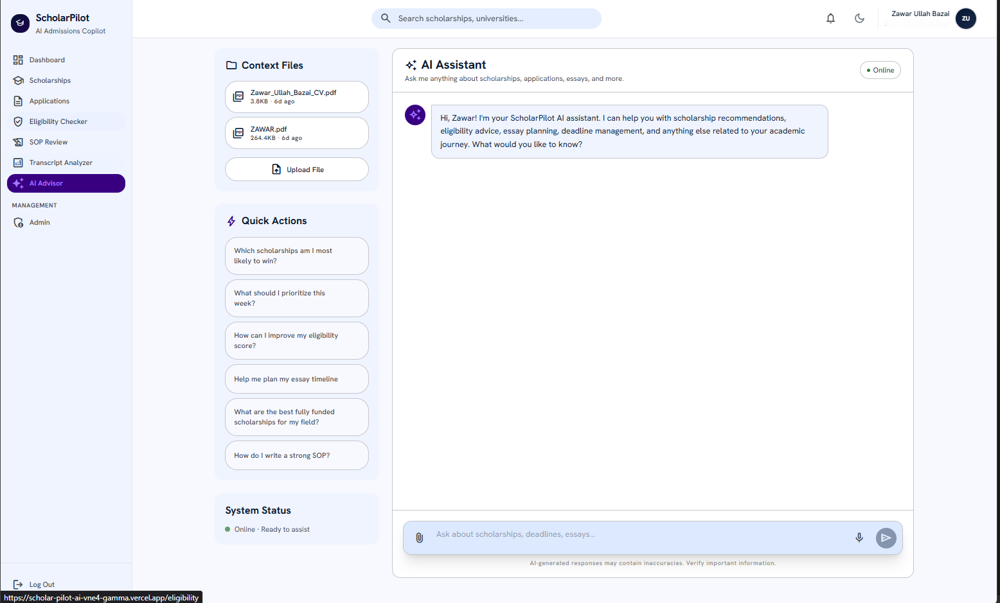
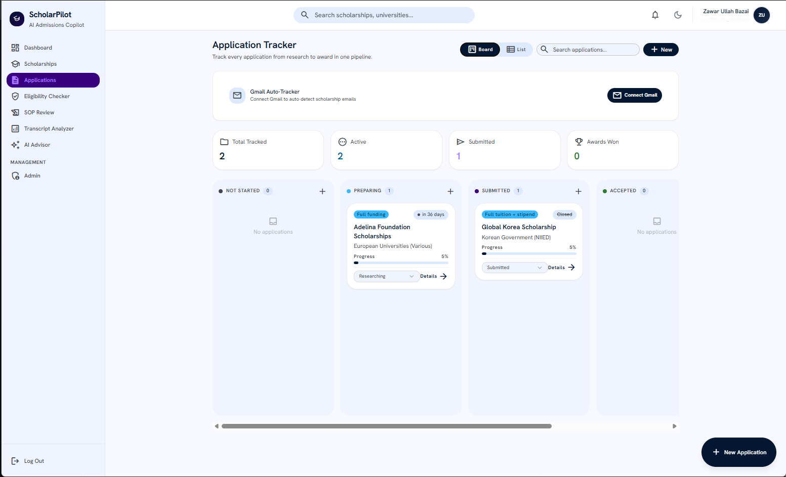
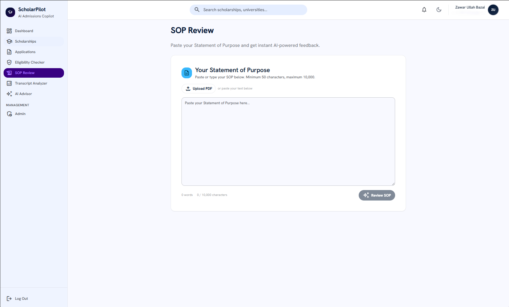
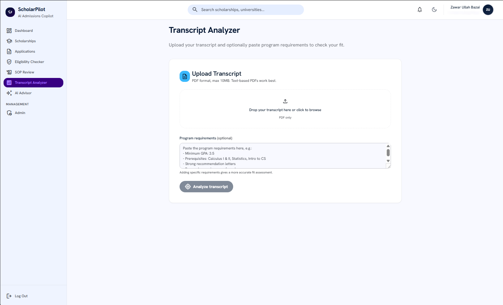

# ScholarPilot AI

**AI-powered scholarship discovery, application tracking, and academic career coaching — all in one platform.**

ScholarPilot solves a real problem: thousands of students miss scholarship deadlines, submit weak applications, and navigate the complex scholarship landscape alone. The platform combines a comprehensive scholarship database with AI-powered tools that analyze transcripts, review essays, check eligibility, and even auto-track applications from Gmail — giving students a competitive advantage in securing funding for their education.

---

## Live Demo

**[https://scholar-pilot-ai-vne4-gamma.vercel.app/](https://scholar-pilot-ai-vne4-gamma.vercel.app/)**

---

## Features

### Core Platform
- **Smart Scholarship Explorer** — Browse 65+ scholarships with search, sort (deadline / AI match), country filters, and degree-level filtering (Undergraduate / Graduate / Postgraduate)
- **AI Eligibility Scoring** — Every scholarship shows a real-time AI-generated match score based on your profile (CGPA, major, country, degree, test scores)
- **Application Tracker** — Kanban-style board with drag-and-drop status management (Researching → Drafting → Submitted → Awarded/Rejected), progress auto-calculates from status
- **Saved Scholarships** — Bookmark opportunities and get deadline countdowns
- **Profile Builder** — React Hook Form + Zod validation with fields for academic background, test scores (IELTS, GRE), research experience, preferred countries, and budget
- **Dashboard** — Stats overview, upcoming deadlines, recent activity feed, application progress charts (Recharts), and AI-generated insights

### AI-Powered Tools
- **AI Chat Assistant** — Full-context chatbot powered by Groq (Llama 3.3 70B). Has access to your profile, saved scholarships, applications, and the entire catalog. Ask anything about scholarship strategy, essay planning, deadline management
- **Eligibility Checker** — Select any scholarship and get a detailed AI analysis: score (0-100), strengths, weaknesses, missing requirements, and actionable recommendations
- **SOP Review** — Upload or paste your Statement of Purpose. AI scores it across 5 dimensions (Grammar, Structure, Clarity, Motivation, Academic Tone) with detailed feedback and improvement suggestions
- **Transcript Analyzer** — Upload a PDF transcript. AI extracts GPA, courses, credits, and assesses fit against optional program requirements. Shows strengths, weaknesses, prerequisite checks, and recommendations
- **AI Scholarship Finder** — Describe what you're looking for (field, country, degree) and AI searches the web for matching scholarships, extracts structured data, and lets you add them to the database with one click. Automatically filters out scholarships already in the catalog

### Gmail Auto-Tracker
- **Connect Gmail** via Google OAuth (read-only)
- **AI Email Scanner** — Scans inbox for scholarship-related emails (confirmations, status updates, acceptances, rejections)
- **Auto-creates/updates applications** based on email content:
  - Congratulations email → status: `awarded`
  - Rejection email → status: `rejected`
  - Application confirmation → status: `submitted`
- Auto-creates new scholarships in the database if not already tracked

### Admin Panel
- **Scholarship CRUD** — Add, edit, delete scholarships with a full form
- **User Management** — View all registered users with creation dates and sign-in history
- **AI Finder Tab** — Use the AI Scholarship Finder from the admin interface
- Email-gated access (only authorized admin emails)

---

## AI System Prompts

### 1. Eligibility Checker (`lib/ai.ts`)

```
You are an expert scholarship advisor. Analyze the following student profile against the scholarship and provide a detailed eligibility assessment.

Return your analysis as valid JSON matching this exact structure:
{
  "eligibilityScore": <number 0-100>,
  "strengths": [<string>, ...],
  "weaknesses": [<string>, ...],
  "missingRequirements": [<string>, ...],
  "recommendations": [<string>, ...],
  "overallSummary": "<1-2 sentence summary>"
}

Rules:
- eligibilityScore must be an integer between 0 and 100.
- strengths: 2-5 specific reasons the student is a good fit.
- weaknesses: 2-4 specific concerns or gaps.
- missingRequirements: list any requirements the student doesn't clearly meet.
- recommendations: 3-5 actionable next steps to improve their chances.
- Be honest and specific, not generic. Reference actual profile data.
```

### 2. SOP Reviewer (`lib/ai.ts`)

```
You are an expert admissions essay reviewer. Analyze the following Statement of Purpose (SOP) and provide a detailed, constructive review.

Return your review as valid JSON:
{
  "overallScore": <number 0-100>,
  "grammar": <number 0-100>,
  "structure": <number 0-100>,
  "clarity": <number 0-100>,
  "motivation": <number 0-100>,
  "academicTone": <number 0-100>,
  "suggestions": [<string>, ...],
  "summary": "<2-3 sentence overall assessment>"
}

Rules:
- grammar: accuracy of grammar, spelling, punctuation, sentence construction.
- structure: logical flow, paragraph organization, introduction-body-conclusion coherence.
- clarity: how clearly ideas are expressed, absence of ambiguity or jargon overload.
- motivation: strength of demonstrated passion, goals, and why this field/programme.
- academicTone: formality, precision, objectivity, and scholarly voice.
- suggestions: 5-8 specific, actionable improvement suggestions.
```

### 3. AI Chat Assistant (`app/api/chat/route.ts`)

```
You are ScholarPilot AI, a helpful scholarship advisor and academic career coach.
You help students find scholarships, plan applications, improve eligibility, write essays,
and navigate the scholarship process.

You have access to the student's profile, saved scholarships, applications, and the full
scholarship catalog. Use this data to give personalized, specific advice.

Guidelines:
- Be conversational, warm, and encouraging.
- Give specific, actionable advice — not generic platitudes.
- Reference the student's actual data in your responses.
- When recommending scholarships, mention specific names and deadlines.
- Keep responses concise but thorough.
- You can help with: scholarship search, eligibility assessment, essay review,
  deadline planning, application strategy, interview prep, visa guidance.
```

### 4. Transcript Analyzer (`app/api/transcript-analyzer/route.ts`)

```
You are an academic advisor. Analyze the following student transcript and provide a
detailed assessment. Return valid JSON with: student_info, academic_record (GPA, courses
with grades/credits/categories), strengths, weaknesses, gpa_trend, program_fit (score,
meets/missing requirements, recommendations), and course_analysis (relevant courses,
grade summary, prerequisite check).

Rules:
- If program requirements are not provided, assess generally.
- Be specific — reference actual course names and grades from the transcript.
- Be honest about weaknesses — this helps the student prepare.
```

### 5. Gmail Scholarship Scanner (`app/api/gmail/scan/route.ts`)

```
You are a scholarship email analyzer. Given these emails from a student's inbox,
determine which ones are scholarship-related and what action to take.

For each email determine:
- Is it scholarship-related?
- Best matching scholarship title from the database (or new)
- Action: create new application, update existing, or ignore
- Status: researching, drafting, submitted, awarded, or rejected
- Brief summary of what the email says

Rules:
- Acceptance/congratulations → status="awarded"
- Rejection/regret → status="rejected"
- Application received/confirmation → status="submitted"
- Ignore spam, newsletters, or unrelated emails.
```

---

## Tools, Services & AI Models

| Category | Technology |
|---|---|
| **Framework** | Next.js 14 (App Router) |
| **Language** | TypeScript (strict) |
| **AI Model** | Groq Cloud — Llama 3.3 70B Versatile |
| **AI SDK** | `groq-sdk` |
| **Database** | Supabase (PostgreSQL + Row Level Security) |
| **Authentication** | Supabase Auth (Email/Password + Google OAuth) |
| **UI Components** | shadcn/ui (Radix UI + Tailwind CSS) |
| **Forms** | React Hook Form + Zod validation |
| **PDF Parsing** | pdfjs-dist (client-side text extraction) |
| **Charts** | Recharts |
| **Hosting** | Vercel |
| **Fonts** | Inter (body) + Plus Jakarta Sans (headings) |
| **Icons** | Lucide React |

---

## Screenshots

### Dashboard

*Overview with stats, upcoming deadlines, activity chart, and AI insights.*

### Scholarship Explorer

*Browse, search, and filter 65+ scholarships with AI eligibility scores.*

### Eligibility Tracker

*Compares your profile against scholarship and tracks your chances of achieving it.*

### AI Chat Assistant

*Context-aware chatbot with access to your profile, saved scholarships, and application data.*

### Application Tracker

*Kanban board with Gmail integration and auto-calculated progress.*

### SOP Review

*AI-powered essay review with multi-dimensional scoring.*

### Transcript Analyzer

*PDF transcript parsing with program fit assessment.*

---

## How to Run

### Prerequisites
- Node.js 18+
- A Supabase project (free tier works)
- A Groq API key (free at [console.groq.com](https://console.groq.com))
- (Optional) Google Cloud project with Gmail API for auto-tracking

### 1. Clone the repository
```bash
git clone https://github.com/zawarbazai9-ui/ScholarPilot-AI
cd scholarpilot
```

### 2. Install dependencies
```bash
npm install
```

### 3. Set up environment variables
Create a `.env` file in the project root:
```env
NEXT_PUBLIC_SUPABASE_URL=https://your-project.supabase.co
NEXT_PUBLIC_SUPABASE_ANON_KEY=your-anon-key
SUPABASE_SERVICE_ROLE_KEY=your-service-role-key

GROQ_API_KEY=gsk_your-groq-key

ADMIN_EMAILS=your-email@gmail.com
NEXT_PUBLIC_ADMIN_EMAILS=your-email@gmail.com

GOOGLE_CLIENT_ID=your-google-client-id
NEXT_PUBLIC_GOOGLE_CLIENT_ID=your-google-client-id
GOOGLE_CLIENT_SECRET=your-google-client-secret
```

### 4. Set up the database
Run the SQL migrations in your Supabase SQL Editor:
```bash
# Run these files in order from supabase/ directory:
# 1. 001_initial.sql
# 2. 002_scholarships.sql
# 3. 003_rls_policies.sql
# 4. 004_triggers.sql
# 5. 005_seed_data.sql
```

Or use the migration scripts:
```bash
node scripts/fix-profile.js
node scripts/seed-more.js
node scripts/add-profile-cols.js
node scripts/add-gmail-cols.js
```

### 5. Start the development server
```bash
npm run dev
```

Open [http://localhost:3000](http://localhost:3000) in your browser.

### 6. (Optional) Set up Gmail Auto-Tracking
1. Create a Google Cloud project at [console.cloud.google.com](https://console.cloud.google.com)
2. Enable the Gmail API
3. Configure OAuth consent screen (External, Testing mode)
4. Create OAuth 2.0 credentials (Web application)
5. Add `http://localhost:3000/api/auth/google/callback` as authorized redirect URI
6. Add your Google email as a test user
7. Copy Client ID and Client Secret to your `.env`

---

## Project Structure

```
ScholarPilot/
├── app/
│   ├── (auth)/                  # Sign-in, sign-up, reset-password
│   ├── (app)/                   # Authenticated pages
│   │   ├── admin/               # Admin panel (scholarships CRUD, users)
│   │   ├── applications/        # Application tracker with Gmail integration
│   │   ├── assistant/           # AI chat assistant
│   │   ├── dashboard/           # Overview dashboard with charts
│   │   ├── profile/             # Profile builder (Zod + react-hook-form)
│   │   ├── scholarships/        # Scholarship explorer + detail pages
│   │   ├── settings/            # Theme, notifications, data export
│   │   ├── sop-review/          # AI SOP reviewer
│   │   └── transcript-analyzer/ # AI transcript analyzer
│   ├── api/
│   │   ├── auth/google/         # Google OAuth callback
│   │   ├── chat/                # AI assistant chat endpoint
│   │   ├── eligibility/         # AI eligibility checker
│   │   ├── gmail/               # Gmail status + AI email scanner
│   │   ├── sop-review/          # AI SOP review endpoint
│   │   ├── transcript-analyzer/ # AI transcript analysis
│   │   ├── scholarship-finder/  # AI scholarship discovery
│   │   └── admin/               # Admin API routes
│   ├── page.tsx                 # Landing page
│   └── layout.tsx               # Root layout (fonts, providers)
├── components/                  # 17 custom components + shadcn/ui
├── lib/
│   ├── ai.ts                    # AI utilities (Groq), eligibility, SOP review
│   ├── db.ts                    # Database queries (Supabase)
│   ├── types.ts                 # TypeScript types
│   ├── supabase.ts              # Client-side Supabase client
│   ├── supabase-admin.ts        # Server-side admin client
│   └── admin.ts                 # Admin auth helpers
├── scripts/                     # DB migration and seed scripts
└── supabase/                    # SQL migration files
```

---

## Database Schema

| Table | Description |
|---|---|
| `profiles` | User profiles (1:1 with auth.users). Fields: full_name, country, degree, major, cgpa, university, research_experience, ielts, gre, preferred_countries, budget, gmail_* |
| `scholarships` | Public scholarship catalog. Fields: title, university, country, degree, funding, deadline, description, requirements, official_link |
| `saved_scholarships` | User bookmarks (owner-scoped RLS) |
| `applications` | Application tracking with status enum, progress (0-100), notes |

All tables use Supabase Row Level Security with owner-scoped policies. The scholarships table is publicly readable but admin-write-only.

---

## Environment Variables

| Variable | Required | Description |
|---|---|---|
| `NEXT_PUBLIC_SUPABASE_URL` | Yes | Supabase project URL |
| `NEXT_PUBLIC_SUPABASE_ANON_KEY` | Yes | Supabase anonymous key |
| `SUPABASE_SERVICE_ROLE_KEY` | Yes | Supabase service role key (server-side only) |
| `GROQ_API_KEY` | Yes | Groq API key for AI features |
| `ADMIN_EMAILS` | Yes | Comma-separated admin email addresses |
| `NEXT_PUBLIC_ADMIN_EMAILS` | Yes | Same as above (client-side access) |
| `GOOGLE_CLIENT_ID` | Optional | Google OAuth client ID (for Gmail) |
| `NEXT_PUBLIC_GOOGLE_CLIENT_ID` | Optional | Same as above (client-side) |
| `GOOGLE_CLIENT_SECRET` | Optional | Google OAuth client secret |

---

## License

MIT
